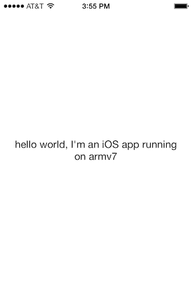

# Janus

Janus is a proof of concept for building a "multiversal" fat binary: a binary that runs both on iOS and OSX.

More specifically, the binary is:

- cross-platform: it runs on arm and x86.
- platform-aware: it know what hardware it runs on (armv7, armv7s, arm64, x86_64)

## Description

### Targets 

The project contains 3 targets:

- *Janus-iOS*: an iOS application that displays the name of the architecture (armv7, armv7s, arm64) of the device it is running on (both on console and screen).

- *Janus-OSX*: an OSX binary that displays the name of the architecture (i386, x86_64) of the computer it is running on.

- *Janus-Universal*: an aggregated target that add the _Janus-OSX_ binary in _Janus-iOS_, making it a cross-platform universal binary that runs on both OSX and iOS.

### Architecture

_CURRENT_ARCH_ is an environment variable set by Xcode when building. The _Other C flags_ (in the _build settings_) has been set to `-DCURRENT_ARCH=\"$CURRENT_ARCH\"`. In result, the _CURRENT_ARCH_ is made available in the source code as a macro definition.

In _ACViewController_ (Janus-iOS) and _main.m_ (Janus-OSX), the macro is used to both statically (_printf_) and dynamically (_strcmp_ + label).

Using this macro, it is possible to have different binaries for each platform. They can both be different (statically, as the source code) and act differently (dynamically, at run time). For instance, It would be possible, if we are completely crazy, to have two complete different games in the same app, depending on the platform it is run on (NOT recommended for the app store).

### Cross-architecture

`lipo` is used in *Janus-Universal* to add the *Janus-OSX* binary to the *Janus-iOS* binary. As a result, _Janus-iOS.app/Janus-iOS_ is a binary that runs both on iOS and OSX.

### Code signing

Code signing is specific to each platform and needs to be addressed *before* _lipo_-ing. 
Specifically, an OSX binary will not run if signed with an iOS identity.

*Janus-Universal* is used to `lipo`, after the *Janus-iOS* as been completly build (including codesigning), because it is not possible to run a _build phase_ script (to `lipo`) after the code signing.

Code signing *both* the iOS and OSX code hasn't been tested.

### Frameworks

_lipo_-ing only means the different binary codes are merged together in one binary file.

This does not mean in any way that a OSX binary can use iOS frameworks (UIKit) nor the other way around (APPKit).

## Directions

### Building

To build the project, build *Janus-Universal*.

### Inspecting

In the build directory (typically _DerivedData/Janus/Build/Products_), you'll find the _Janus-iOS.app_. Its binary, _Janus-iOS_ is multiversal and can be run on iOS (arm) and OSX (x86_64).

Inspecting the binary with `lipo` will show 4 architectures:

	$ lipo -info ./Debug-iphoneos/Janus-iOS.app/Janus-iOS
	Architectures in the fat file: ./Debug-iphoneos/Janus-iOS.app/Janus-iOS are: x86_64 armv7 armv7s arm64

As well as `otool`:

	$ otool -f ./Debug-iphoneos/Janus-iOS.app/Janus-iOS
	
	Fat headers
	fat_magic 0xcafebabe
	nfat_arch 4
	architecture 0
    	cputype 16777223
	    cpusubtype 3
    	capabilities 0x80
	    offset 4096
    	size 9160
	    align 2^12 (4096)
	architecture 1
    	cputype 12
	    cpusubtype 9
    	capabilities 0x0
	    offset 16384
    	size 64432
	    align 2^14 (16384)
	architecture 2
    	cputype 12
	    cpusubtype 11
    	capabilities 0x0
	    offset 81920
    	size 64448
	    align 2^14 (16384)
	architecture 3
    	cputype 16777228
	    cpusubtype 0
    	capabilities 0x0
	    offset 147456
    	size 64752
	    align 2^14 (16384)

### Running

#### Running on OSX

In a console, running _Janus-iOS.app/Janus-iOS_ should display the architecture name and a "hello":

	$ ./Debug-iphoneos/Janus-iOS.app/Janus-iOS
	
	x86_64
	2014-03-27 15:29:31.160 Janus-iOS[73947:507] hello world, I'm an OSX binary running on x86_64

#### Running on iOS

As explained before, you can't run the app in the simulator.

Attach a device, and in Xcode, Run, but without building, *Janus-iOS* (_Product_ > _Perform action_ > _Run Without building_ or _^⌘R_) (do not "Build and run", as it will recompile and remove OSX binary part).

